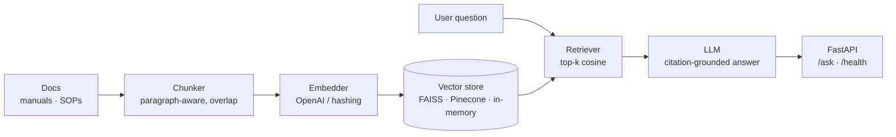

# RAG Support Automation

[](https://github.com/saianthireddy/rag-support-automation/actions/workflows/ci.yml) [](https://github.com/saianthireddy/rag-support-automation) [](LICENSE)

**Intelligent Technical Knowledge & Support Automation Platform** — an end-to-end Retrieval-Augmented Generation (RAG) system that answers technical support questions from enterprise knowledge sources (manuals, SOPs, support documentation) with grounded, citation-backed responses.

Built to reduce support ticket volume by automating first-line technical support: documents are ingested, chunked, embedded, and indexed in a vector store; incoming questions retrieve the most relevant context, and an LLM generates an answer strictly grounded in that context.

## Architecture



Every layer sits behind a small interface, so backends are swappable via config:

| Layer        | Production                     | Offline / tests          |
|--------------|--------------------------------|--------------------------|
| Embeddings   | OpenAI `text-embedding-3-small`| Deterministic hashing embedder |
| Vector store | FAISS or Pinecone              | Pure-python cosine store |
| LLM          | OpenAI chat completions        | Injectable fake LLM      |

This means the full pipeline — including the API — runs and tests **without any API keys**.

## Features

- **Document ingestion** — recursive loading of manuals/SOPs with paragraph-aware chunking and sliding-window overlap
- **Semantic search** — cosine similarity over embeddings, with FAISS (self-hosted) and Pinecone (managed) backends
- **Grounded generation** — answers cite source documents; questions outside the knowledge base are escalated, not hallucinated
- **FastAPI service** — `/ask` and `/health` endpoints with Pydantic validation
- **Production-ready** — Dockerfile, docker-compose, GitHub Actions CI (lint + tests on Python 3.11/3.12)

## Quickstart

```bash
git clone https://github.com/<you>/rag-support-automation.git
cd rag-support-automation

python -m venv .venv && source .venv/bin/activate
pip install -r requirements-dev.txt

# run the test suite (no API keys needed)
pytest -q

# start the API
export PYTHONPATH=src
uvicorn rag_support.api.main:app --reload
```

Ask a question:

```bash
curl -X POST http://localhost:8000/ask \
  -H "Content-Type: application/json" \
  -d '{"question": "How do I restart the device?"}'
```

### With OpenAI + Pinecone (production mode)

```bash
cp .env.example .env   # add OPENAI_API_KEY (and PINECONE_API_KEY if using Pinecone)
docker compose up --build
```

## Project structure

```
src/rag_support/
├── config.py            # env-driven settings
├── ingestion/           # document loading + chunking
├── embeddings/          # OpenAI + hashing embedders behind one interface
├── vectorstore/         # FAISS, Pinecone, in-memory backends
├── retrieval/           # top-k semantic retriever
├── generation/          # prompts + RAG chain
└── api/                 # FastAPI app + schemas
scripts/ingest.py        # CLI ingestion with chunk statistics
scripts/eval_retrieval.py # CLI retrieval-quality eval (precision/recall/MRR)
tests/                   # unit + API tests (offline, deterministic)
data/sample_docs/        # example manual + SOP
```

## Ingest your own docs

Drop `.md`/`.txt` files into a folder and run:

```bash
python scripts/ingest.py path/to/your/docs
```

## Retrieval evaluation

`scripts/eval_retrieval.py` runs a small labeled query set (each query paired
with the source document it should retrieve from) against the offline
hashing-embedder + in-memory-store pipeline, and reports precision, recall,
and MRR. It's fully offline and runs in well under a second, so it's cheap
enough to run on every change to the chunking or retrieval logic.

```bash
python scripts/eval_retrieval.py
```

```
Evaluated 6 labeled queries against top-4 retrieval

Metric            Score
-----------------------
Precision@1        1.00
Recall@4           1.00
MRR                1.00
```

The eval set lives in the script (`EVAL_SET`) — add a row any time a new
sample doc is added under `data/sample_docs/`, so retrieval quality stays
covered as the knowledge base grows.

## Testing & CI

```bash
pytest -q          # 14 tests, all offline
ruff check src tests
```

CI runs lint and the full suite on every push and pull request (see `.github/workflows/ci.yml`).

## License

MIT
