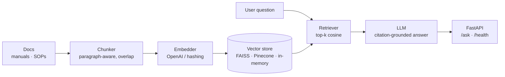

# RAG Support Automation

[](https://github.com/saianthireddy/rag-support-automation/actions/workflows/ci.yml) [](https://github.com/saianthireddy/rag-support-automation) [](LICENSE)

**Intelligent Technical Knowledge & Support Automation Platform** — an end-to-end Retrieval-Augmented Generation (RAG) system that answers technical support questions from enterprise knowledge sources (manuals, SOPs, support documentation) with grounded, citation-backed responses.

Built to reduce support ticket volume by automating first-line technical support: documents are ingested, chunked, embedded, and indexed in a vector store; incoming questions retrieve the most relevant context, and an LLM generates an answer strictly grounded in that context.

## Provenance

This is a clean-room reimplementation of a technical-support RAG platform I built at
Teledyne Technologies. The production system is proprietary — none of its code, data,
documents, or configuration appears in this repository.

What carries over is the architecture and the design decisions behind it: paragraph-aware
chunking with sliding-window overlap, every layer behind a swappable interface, and strict
grounding that escalates out-of-corpus questions rather than answering them. What does not
carry over is anything I couldn't write from scratch — the sample corpus in `data/sample_docs`
is synthetic, and the whole pipeline runs offline with no API keys.

Repository history starts July 2026, when I rebuilt it in public.

## Architecture


```mermaid
flowchart LR
    A["Docs<br/>manuals · SOPs"] --> B["Chunker<br/>paragraph-aware, overlap"]
    B --> C["Embedder<br/>OpenAI / hashing"]
    C --> D[("Vector store<br/>FAISS · Pinecone · in-memory")]
    Q["User question"] --> R["Retriever<br/>top-k cosine"]
    D --> R
    R --> G["LLM<br/>citation-grounded answer"]
    G --> API["FastAPI<br/>/ask · /health"]
```

Every layer sits behind a small interface. What the running API actually wires today, and what exists but isn't wired yet:

| Layer        | Wired into the API (env var)                                   | Exists, not wired yet |
|--------------|----------------------------------------------------------------|-----------------------|
| Pipeline     | `PIPELINE=native` (hand-rolled) or `langchain` (LCEL)          | —                     |
| Embeddings   | Deterministic hashing embedder                                 | OpenAI `text-embedding-3-small` |
| Vector store | `VECTOR_BACKEND=memory` or `chroma` (embedded ChromaDB)        | FAISS, Pinecone       |
| LLM          | OpenAI chat when `OPENAI_API_KEY` is set; otherwise the retrieved context is returned | — |

This means the full pipeline — including the API — runs and tests **without any API keys**.

## Features

- **Document ingestion** — recursive loading of manuals/SOPs with paragraph-aware chunking and sliding-window overlap
- **Semantic search** — cosine similarity over embeddings, in an in-memory store or embedded ChromaDB (`VECTOR_BACKEND`); FAISS and Pinecone adapters exist behind the same interface but aren't wired into the API
- **Two pipelines, one recipe** — the hand-rolled chain and a LangChain (LCEL) version share the embedder, chunks, relevance floor, prompts and escalation, and score identically on the eval (see [LangChain vs the hand-rolled pipeline](#langchain-vs-the-hand-rolled-pipeline))
- **Grounded generation** — answers cite source documents. A relevance floor (`MIN_SCORE`) drops weak matches, so a question the corpus can't answer retrieves nothing and is escalated to a human instead of being answered from unrelated chunks. Measured on the eval below: 10 of 12 off-topic questions are escalated, and no answerable question is
- **FastAPI service** — `/ask` and `/health` endpoints with Pydantic validation
- **Deployable** — Dockerfile, docker-compose, GitHub Actions CI (lint + tests on Python 3.11/3.12)

## Quickstart

```bash
git clone https://github.com/<you>/rag-support-automation.git
cd rag-support-automation

python -m venv .venv && source .venv/bin/activate
pip install -r requirements-dev.txt

# run the test suite (no API keys needed)
pytest -q

# start the API
export PYTHONPATH=src
uvicorn rag_support.api.main:app --reload
```

Ask a question:

```bash
curl -X POST http://localhost:8000/ask \
  -H "Content-Type: application/json" \
  -d '{"question": "How do I restart the device?"}'
```

### Choosing the pipeline, store and LLM

```bash
cp .env.example .env   # PIPELINE, VECTOR_BACKEND, MIN_SCORE, OPENAI_API_KEY are read at startup
docker compose up --build
```

`PIPELINE=langchain VECTOR_BACKEND=chroma` runs the LangChain version on ChromaDB; setting
`OPENAI_API_KEY` swaps the offline fallback for real chat completions in either pipeline.
Embeddings stay on the offline hashing embedder, and Pinecone/FAISS aren't wired yet.

## Project structure

```
src/rag_support/
├── config.py            # env-driven settings
├── ingestion/           # document loading + chunking
├── embeddings/          # OpenAI + hashing embedders behind one interface
├── vectorstore/         # in-memory and ChromaDB (wired); FAISS, Pinecone adapters
├── retrieval/           # top-k semantic retriever
├── generation/          # prompts, hand-rolled RAG chain, LangChain (LCEL) pipeline
└── api/                 # FastAPI app + schemas
scripts/ingest.py        # CLI ingestion with chunk statistics
scripts/eval_retrieval.py # CLI retrieval-quality eval (precision/recall/MRR)
tests/                   # unit + API tests (offline, deterministic)
data/sample_docs/        # example manuals, SOPs, and policy docs
```

## Ingest your own docs

Drop `.md`/`.txt` files into a folder and run:

```bash
python scripts/ingest.py path/to/your/docs
```

## Retrieval evaluation

`scripts/eval_retrieval.py` runs a labeled query set against the offline
hashing-embedder + in-memory-store pipeline and reports precision, recall,
and MRR. It's fully offline and runs in well under a second, so it's cheap
enough to run on every change to the chunking or retrieval logic.

The eval is built to be *failable*: the corpus contains distractor documents
that deliberately share vocabulary ("restart", "error code", "data loss"
each appear in more than one file), and a third of the queries are
paraphrases that describe the problem in a user's words rather than the
document's. An earlier version of this eval scored a perfect 1.00 on every
metric — because the corpus was two documents and `top_k` covered the whole
index, so recall literally could not fail. Perfect scores from a benchmark
that cannot fail measure nothing.

```bash
python scripts/eval_retrieval.py --show-misses
```

```
Evaluated 18 labeled queries against top-4 retrieval

Metric            Score
-----------------------
Precision@1        0.89
Recall@4           1.00
MRR                0.94

Refusal at MIN_SCORE=0.05 (12 off-topic questions)

Off-topic refused           0.83
Answerable refused          0.00
```

These numbers rose from 0.61 / 0.94 / 0.74 after two tokenizer fixes in the
hashing embedder. Punctuation used to stay attached to words, so "device?"
never matched "device". Stopwords ("what", "is", "the") used to dominate the
vectors. The vector size also grew from 256 to 4096 buckets, because hash
collisions were making unrelated words match.

**Refusal.** Retrieval always returns the nearest chunks, even for "How do I
bake sourdough bread?". `MIN_SCORE` drops anything below a similarity floor,
so those questions get no context and the chain escalates. The eval measures
both sides of that trade-off: off-topic questions refused (higher is better)
and answerable questions wrongly refused (must stay at zero). The two
off-topic questions that still get through ("sourdough bread", "the weather
tomorrow") share a content word with a support document, which a
bag-of-words embedder cannot tell apart from a real match. Both question sets
are small and hand-written, and 0.05 was chosen on them (the tightest
separating value was about 0.07), so read these numbers as a sanity check,
not a guarantee. OpenAI embeddings score on a different scale and need their
own `MIN_SCORE`.

The remaining misses are the expected failure mode of hashing embeddings:
paraphrases like "the unit is frozen and unresponsive" (manual says "hold the
power button") lose to lexically-overlapping distractors. That's the headroom
the OpenAI embedding backend exists to close. `--show-misses` prints each
failing query, what outranked it, and any off-topic question that was still
answered. `tests/test_eval.py` fails CI if these numbers regress.

The eval set lives in the script (`EVAL_SET`) — add a row any time a new
sample doc is added under `data/sample_docs/`, so retrieval quality stays
covered as the knowledge base grows.

## LangChain vs the hand-rolled pipeline

The same RAG recipe exists twice: a small hand-rolled chain
(`generation/chain.py`) and a LangChain version in LCEL
(`generation/langchain_pipeline.py`). Both share the embedder, chunks,
`TOP_K`, `MIN_SCORE`, prompts and escalation message, so a difference in the
numbers would come from the framework or the index, not the recipe. Switch
with `PIPELINE=langchain` and `VECTOR_BACKEND=chroma`.

```bash
python scripts/eval_retrieval.py --compare
```

```
Pipeline   Store      P@1   R@4   MRR  Off-topic refused  Answerable refused
----------------------------------------------------------------------------
native     memory    0.89  1.00  0.94               0.83                0.00
native     chroma    0.89  1.00  0.94               0.83                0.00
langchain  memory    0.89  1.00  0.94               0.83                0.00
langchain  chroma    0.89  1.00  0.94               0.83                0.00
```

Identical, as they should be: the framework and the index don't change
retrieval quality here — the embedder and chunking do. Chroma's approximate
(HNSW) index returns the same ranking as exact search on a corpus this small
(8 chunks). `tests/test_langchain_chroma.py` fails CI if any row diverges.

What each is good for, based on building both:

- **LangChain** gives swappable parts for free: `Chroma`, `ChatOpenAI` and the
  retriever's `similarity_score_threshold` plug in with a line each, and LCEL
  makes the flow (retrieve → escalate or prompt → LLM) explicit.
- **Hand-rolled** has fewer surprises. Two things needed fixing on the
  LangChain side: `InMemoryVectorStore` declares no relevance function, so
  threshold retrieval raised until a subclass passed its cosine scores through;
  and a question made only of stopwords ("what is it?") embeds to the zero
  vector, which crashed LangChain's cosine on NaN (Chroma and the native stores
  score it 0, below the floor). LangChain also logs a warning on every
  off-topic question, which is the designed escalation path, so that one
  message is filtered.
- Both escalate **without calling the LLM** when nothing clears the floor,
  which the tests assert.

## Testing & CI

```bash
pytest -q          # 31 tests, all offline
ruff check src tests
```

CI runs lint and the full suite on every push and pull request (see `.github/workflows/ci.yml`).

## License

MIT
